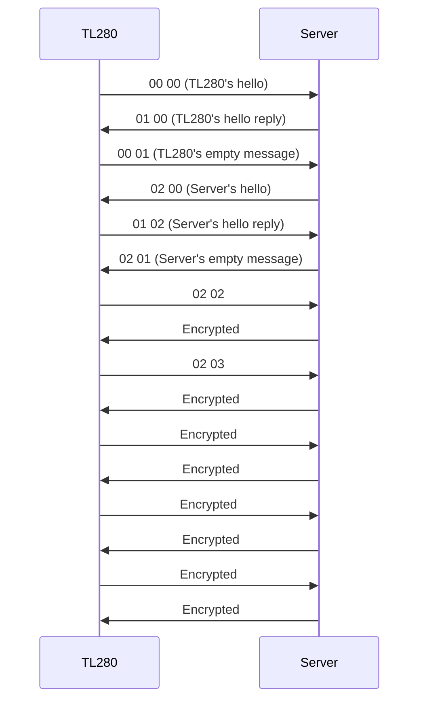

# DSC ITv2 notification

Notifications are sent to integration server using a binary TCP-based protocol.
Actual messages can be send in a raw binary format or encrypted.
Encryption algorithm is probably AES with 128 b key size.
It remains unknown how to obtain a key.

## Messages exchange

It seems that sides (TL280 and integration server) take turns in sending request messages.

Example exchange:

### TL280's turn

1. TL280 sends its basic info / hello packet
2. Server replies to above
3. TL280 sends empty message letting server proceed

### Server's turn

4. Server send its basic info / hello packet
5. TL280 replies to above
6. Server sends empty message letting TL280 proceed

### TL280's turn

7. TL280 requests encryption
8. Server replies to above (**encrypted**)
9. TL280 sends empty message letting server proceed

### Server's turn

10. Server requests encryption (**encrypted**)
11. TL280 replies to above (**encrypted**)
12. Server sends empty message letting TL280 proceed (**encrypted**)

## Messages encapsulation

All ITv2 messages are encapsulated before sending.
TL280 outgoing messages are additionally prepended with 12 B string containing integration ID value (TL280 unique number).
Message gets `7e` byte prepended and `7f` byte appended.

### Outgoing packet example

```
0000   31 32 33 34 35 36 37 38 39 30 31 32 7e 04 00 01   123456789012~...
0010   00 7d 00 7f                                       .}..
```

* `31 32 33 34 35 36 37 38 39 30 31 32`: Integration ID value 123456789012
* `7e`: Start of message
* `04 00 01 00 7d 00`: Actual message
* `7e`: End of message

### Incoming packet example

```
0000   7e 04 02 01 66 1f 7f                              ~...f..
```

* `7e`: Start of message
* `04 02 01 66 1f`: Actual message
* `7e`: End of message

## Message format

* The first byte specifies message length.
* Second and third bytes seem to be message type
* Two last bytes contain CRC-16/CCITT-FALSE checksum.

### Message examples

```
0000   08 01 00 05 02 91 00 de 3c                        ~........<
```

* `08`: Length
* `01 00`: Message type
* `de 3c`: CRC-16 checksum

```
0000   04 02 01 66 1f                                    ~...f.
```

* `04`: Length
* `02 01`: Message type
* `66 1f`: CRC-16 checksum

## Message types

### `00 00`: TR280's hello

```c
struct msg_00_00_tl280_hello {
	uint8_t		length;			/* 0x15 == 21 */
	uint16_t	type;			/* 0x00 0x00 */
	uint8_t		unk1[2];
	uint8_t		seq;			/* Message sequence number? */
	uint8_t		unk2[3];
	uint16_t	firmware_version;	/* E.g. 0x04 0x11 for 4.17 */
	uint16_t	protocol_version;	/* E.g. 0x02 0x11 for 2.17 */
	uint8_t		unk[7];
	uint16_t	crc16;
} __packed;
```

### `01 00`: TR280's hello reply

```c
struct msg_01_00_tl280_hello_reply {
	uint8_t		length;			/* 0x08 == 8 */
	uint16_t	type;			/* 0x01 0x00 */
	uint8_t		unk[2];
	uint8_t		seq;			/* Matches seq from 00 00 (request message sequence number?) */
	uint8_t		unused;			/* Unused? Seems to be always 0x00 */
	uint16_t	crc16;
} __packed;
```

## Example notification messages


